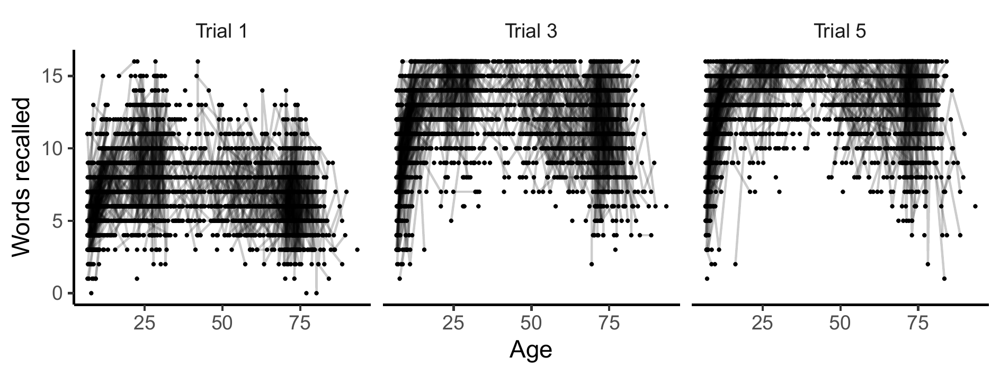
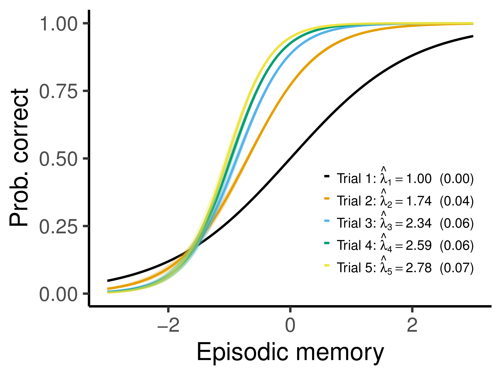
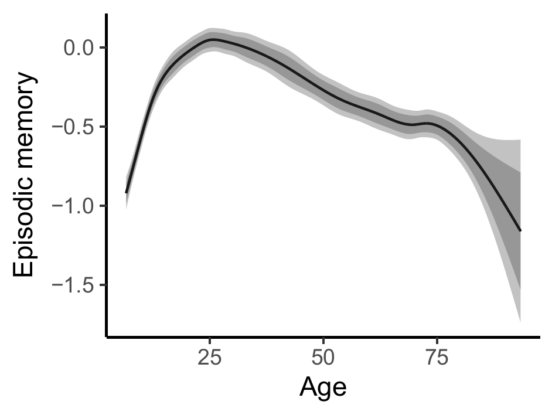
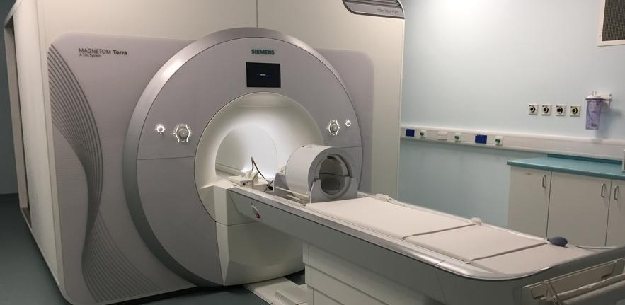
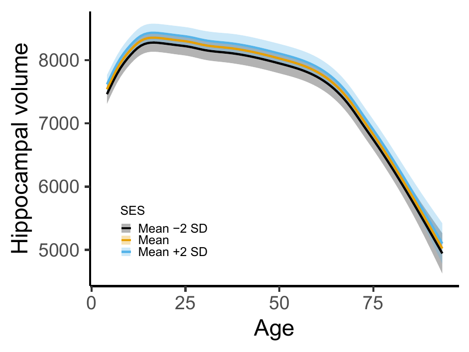

class: inverse, middle, center

# Introduction

---

# Latent Variable Models

In psychology and social science, you often have multiple observations measuring a latent trait of interest, e.g.

- Cognitive abilities follow from responses to different tests.

- Attitudes defined by survey responses.

Classical tools include factor analysis, item response theory, and structural equation models. 

... which are often pretty restrictive

  - Parametric
  
  - Require balanced longitudinal data
  
  - Don't easily allow covariates and multilevel data

---

# Motivating Example

California verbal learning test of **episodic memory**.

  - Five trials at a single test session.
  
  - Latent episodic memory seems to depend smoothly (nonlinearly) on age.
  
  - Both between- and within-session learning effect
  
  - Irregular time intervals
  

---

class: inverse, middle, center

# Generalized Additive Latent and Mixed Models

---

# General Framework

- A combination of generalized additive mixed models1 and generalized linear latent and mixed models2.

semiparametric + latent

--

- Multilevel models with components varying at $L$ levels. $\boldsymbol{\eta}^{(l)}$ denotes a vector of latent variables (random effects) varying at level $l$, and the vector of all latent variables belonging to a given level-2 unit is

$$\boldsymbol{\eta}_{j} = 
\begin{bmatrix}
\boldsymbol{\eta}_{jk\dots z}^{(2)}{}^{'},
\boldsymbol{\eta}_{k\dots z}^{(3)}{}^{'},
\dots,
\boldsymbol{\eta}_{z}^{(L)}{}^{'}
\end{bmatrix}'$$

.footnote[[1] For an introduction, see [Wood (2017), Generalized Additive Models](https://www.taylorfrancis.com/books/mono/10.1201/9781315370279/generalized-additive-models-simon-wood). 
[2] [Skrondal and Rabe-Hesketh (2004), Generalized Latent Variable Modeling](https://www.taylorfrancis.com/books/mono/10.1201/9780203489437/generalized-latent-variable-modeling-anders-skrondal-sophia-rabe-hesketh).]

---

# Part 1: Response Distribution

Elementary units of observation distributed according to an exponential family.

$$f\left(y_{i} | \theta_{i}, \phi\right) = \exp\left\{\frac{y_{i}\theta_{i} - b\left(\theta_{i}\right)}{\phi} + c\left(y_{i}, \phi\right)  \right\}$$

- All responses are stacked in the vector $\mathbf{y} = (y_{1}, y_{2}, \dots, y_{n})'$. 

- Responses can be of mixed type.

---

# Part 2: Measurement Model

$$g\left\{E(y_{i})\right\} = \nu_{i} = \sum_{s=1}^{S} f_{s}\left(\mathbf{x}_{i}\right) + \sum_{l=2}^{L}\sum_{m=1}^{M_{l}} \eta_{m}^{(l)} \mathbf{z}^{(l)}_{mi}{}^{'}\boldsymbol{\lambda}_{m}^{(l)}$$

- Hierarchical model with $L$ levels. Each level $l$ has $M_{l}$ latent variables. Factor loadings $\boldsymbol{\lambda}_{m}^{(l)}$ link the latent variables $\eta_{m}^{(l)}$ to the observed measurements $y_{i}$.

- Related to confirmatory factor analysis: $\mathbf{y} = \boldsymbol{\Lambda}\boldsymbol{\eta}$.

Smooth functions $f_{s}(\cdot)$, e.g., 

$$f_{s}\left(\mathbf{x}_{i}\right) = \sum_{k=1}^{B_{s}} \omega_{ks} b_{ks}\left(\mathbf{x}_{i}\right), ~ s=1, \dots, S.$$

with weights $\omega_{ks}$ constrained by some smoothing penalty.

---

# Part 3: Structural Model

Structural model

$$\boldsymbol{\eta}_{j} = \mathbf{B}\boldsymbol{\eta}_{j} + \mathbf{h}\left(\mathbf{w}_{j}\right)+ \boldsymbol{\zeta}_{j}$$

- $\mathbf{B}$ contains regression coefficients between latent variables.

- $\mathbf{h}\left(\mathbf{w}_{j}\right)$ are smooth functions describing how the latent variables depend on explanatory variables.

- Related to structural equation models: $\boldsymbol{\eta} = \mathbf{B}\boldsymbol{\eta} +\boldsymbol{\Gamma}\mathbf{w}+ \boldsymbol{\zeta}$.

---

# Mixed Model Representation

- Through a series of transformations, we show that GALAMMs with $L$ levels are equivalent to nonlinear mixed models with $L+1$ levels, with linear predictor

$$\nu = f\left(X, \beta\right) + Z\left(\beta\right) \eta, ~~~ \eta \sim N(0, \Psi)$$

- Importantly, the mixed model representation does the spline smoothing1.

- Can fit it with a profile likelihood approach, utilizing efficient mixed model software (`lme4`/`nlme`)2.

- We use this to derive asymptotic covariance matrices for all functions and parameters.

.footnote[[1] Following [Kimeldorf and Wahba (1970)](https://projecteuclid.org/journals/annals-of-mathematical-statistics/volume-41/issue-2/A-Correspondence-Between-Bayesian-Estimation-on-Stochastic-Processes-and-Smoothing/10.1214/aoms/1177697089.full).

[2] Using an algorithm proposed in [Jeon and Rabe-Hesketh (2012)](https://doi.org/10.3102/1076998611417628).
]

---

class: inverse, middle, center

# Applications

---

# Episodic Memory

---

# Episodic Memory

Measurement model for elementary unit $i$:

$$\nu_{i} = \underbrace{\mathbf{d}_{ti}'\boldsymbol{\beta}_{t}}_{\text{test version}} + \underbrace{d_{ri}\beta_{r}}_{\text{retest effect}} + \underbrace{\mathbf{d}_{ti}'\boldsymbol{\lambda}}_{\text{factor loading}}\sum_{l=2}^{3} \underbrace{\eta^{(l)}}_{\text{latent level}}$$

In words:

- Linear predictor for the probability of answering correctly on the test is a function of some covariates as well as the true latent level of episodic memory.

---

# Episodic Memory

Structural model for level-2 unit $j$:

$$\boldsymbol{\eta}_{j} = 
\begin{bmatrix}
\eta_{jk}^{(2)} \\
\eta_{k}^{(3)}
\end{bmatrix} 
= 
\underbrace{
\begin{bmatrix}
h\left(w_{jk}\right) \\
0
\end{bmatrix} 
}_{\text{smooth fun. of age}}
+
\underbrace{
\begin{bmatrix}
\zeta_{jk}^{(2)} \\
\zeta_{k}^{(3)}
\end{bmatrix}}_{\text{random intercepts}}$$

For a given participant:

- $\eta_{jk}^{(2)}$ is the latent level of episodic memory at a given timepoint.

- $\eta_{k}^{(3)}$ is the random intercept of episodic memory across timepoints.

- $h(w_{jk})$ subject to penalty $\gamma \int \{h''(u)\}^{2}  \text{d}u$

---

# Episodic Memory

Reduced form model

$$\nu_{i} = \mathbf{d}_{ti}'\boldsymbol{\beta}_{t} + d_{ri}\beta_{r} + h\left(w_{jk}\right) \mathbf{d}_{ti}'\boldsymbol{\lambda} + \zeta_{jk}^{(2)}\mathbf{d}_{ti}'\boldsymbol{\lambda} + \zeta_{k}^{(3)} \mathbf{d}_{ti}'\boldsymbol{\lambda}$$

is actually a logistic nonlinear mixed model with 4 hierarchical levels.

---

# Episodic Memory

Some results, based on 3470 timepoints for 1850 participants between 6 and 93 years of age.

.pull-left[

<h3>Item response curves</h3>

]
.pull-right[

<h3>Lifespan trajectory</h3>

]

---

# Episodic and Working Memory

Multivariate questions are more interesting:

- How is change in cognitive performance correlated across cognitive domains?

--

We extended the previous model to a factor-by-curve model, with some items measuring working memory and others measuring episodic memory.

- Math is in the paper.

---

# Episodic and Working Memory

Density plot (right) obtained with empirical Bayes posterior sampling.

The estimated correlation between random intercepts was 0.41. Hence, people's episodic memory and working memory are positively correlated.

---

class: inverse, middle, center

# Another Application

---

# Socioeconomic Status and Hippocampus

- Hippocampus: important brain region. One of the to be damaged in Alzheimer's disease. 

- Has been suggested that low socioeconomic status is bad for development of the hippocampus, and hence is a risk factor for dementia.

.pull-left[
  
]
.pull-right[
  
]

---

# Socioeconomic Status and Hippocampus

Data from 4196 MRI scans of 1886 participants.

---

# Socioeconomic Status and Hippocampus

- We defined socioeconomic status (SES) as a latent variable measured by income and education level. For children: parents' education and income.

- Latent covariate model, with response $y_{i}$ constructed by stacking income, education, and hippocampal volume:

$$y_{i} = \mathbf{d}_{\text{s},i}'\boldsymbol{\beta}_{\text{s}} + d_{h,i}\left\{ \mathbf{x}_{\text{h},i}' \boldsymbol{\beta}_{\text{h}} + f\left(a_{i}\right)\right\} +  \eta_{1}^{(2)} \mathbf{z}_{i}' \boldsymbol{\lambda} + d_{\text{h},i} \eta_{2}^{(2)} + \epsilon_{i}$$

Research question:

  - How does socioeconomic status $\eta_{1}^{(2)}$ interact with the lifespan hippocampal trajectory $f(a_{i})$?
  
--
  
  - Conditional effect of age given socioeconomic status $\eta_{1}^{(2)}$ is
  
$$f(a_{i}) + \eta_{1}^{(2)}\left(\lambda_{7} + \lambda_{8}a_{i}\right)$$
  

---

# Socioeconomic Status and Hippocampus

Conclusion:

- 95% CIs for both the offset effect and the interaction effect contained zero. Hence, not much evidence for an effect of socioeconomic status on hippocampal volume in these data.

---

# Computation

- Profile likelihood algorithm used here is convenient, but does not scale very well, and also relies on Laplace approximation through the use of `lme4`.

- When the grouping structure is strictly hierarchical, it is possible to integrate out the latent variables from the likelihood function using adaptive quadrature rules1.

--

Marginal log-likelihood is a nested integral

$$l(\theta) = \int_{{\mathbb{R}}^{M_{L}}} \dots \int_{{\mathbb{R}}^{M_{2}}} \sum\log f(\theta | \boldsymbol{\eta}^{(2)},\dots, \boldsymbol{\eta}^{(L)}) \text{d}\boldsymbol{\eta}^{(2)} \dots \text{d}\boldsymbol{\eta}^{(L)}$$
Finding $\hat{\theta} = \text{argmax}\{l(\theta)\}$ requires high-dimensional integration at each step of the optimization algorithm.

.footnote[[1] [Rabe-Hesketh, Skrondal, and Pickles (2005)](https://doi.org/10.1016/j.jeconom.2004.08.017), [Pinheiro and Chao (2006)](https://doi.org/10.1198/106186006X96962)]

  
---

# Computation - Work in progress

### Idea

- Formulate adaptive quadrature integration as a series of sparse matrix operations.

- The number of smoothing parameters is typically high $(\geq 10)$; Cartesian product quadrature intractable. Interesting alternative: Scalable spherical cubature rules growing quadratically in the dimension1.

### Status

- Works well with two-level models, but this nothing new. R package `GLMMadaptive` offers this already.

- Scalable extension to $L>2$ requires indicator matrices mapping latent variables at different levels, which is a bit tricky.

  

.footnote[[1] [Lu and Darmofal (2004)](https://epubs.siam.org/doi/abs/10.1137/S1064827503426863)]

---

class: inverse, middle, center

# Summary

---

# Summary

- Generalized additive latent and mixed models allow multilevel latent variable modeling when the latent variables depend smoothly on one or more observed covariates.

  - R package: https://github.com/LCBC-UiO/galamm
  
  - Extensive simulations suggest that estimates are close to unbiased and asymptotic covariance matrices are accurate with moderate sample sizes.

### Preprint

Sørensen, Ø., Fjell, A. M., & Walhovd, K. B. (2021). <i>Longitudinal modeling of age-dependent latent traits with generalized additive latent and mixed models</i>. ArXiv:2105.02488 [Stat]. http://arxiv.org/abs/2105.02488

---

class: center, middle

# Thanks!

These slides are available at https://osorensen.rbind.io/.

Created via the R package [xaringan](https://github.com/yihui/xaringan).

